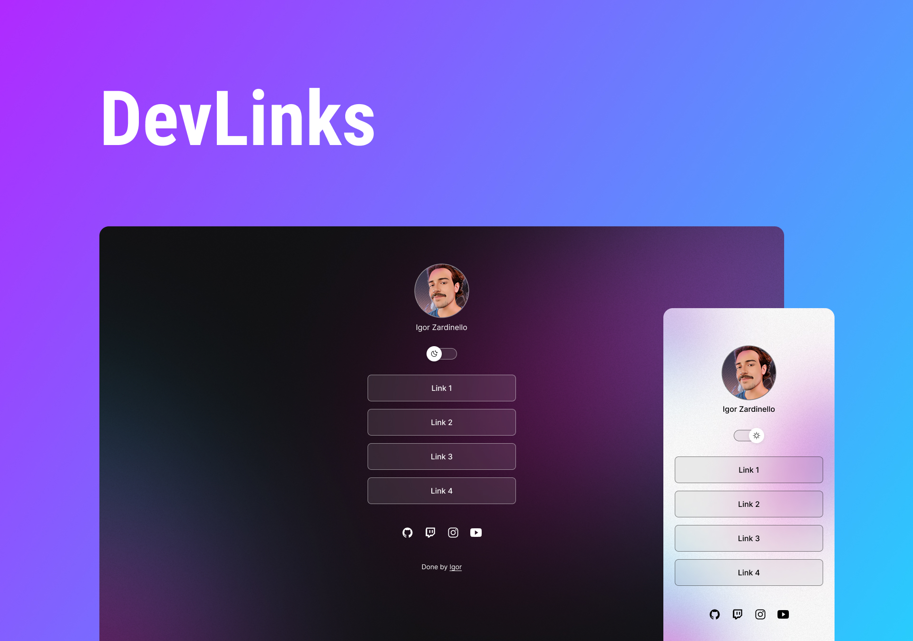

<h1 align="center"> DevLinks </h1>

  <a href="#-tecnologias">Tecnologies</a>&nbsp;&nbsp;&nbsp;|&nbsp;&nbsp;&nbsp;
  <a href="#-projeto">Project</a>&nbsp;&nbsp;&nbsp;|&nbsp;&nbsp;&nbsp;
  <a href="#-layout">Layout</a>&nbsp;&nbsp;&nbsp;|&nbsp;&nbsp;&nbsp;
  <a href="#memo-licença">License</a>

  

 

  

## 🚀 Technologies

This project was developed with these technologies:

- HTML e CSS
- JavaScript
- Git e Github
- Figma

## 💻 Project

DevLinks is a link aggregator to use as an online business card.

- [Check the project done, online](https://igormaehler.github.io/devLinks/)

## 🔖 Layout

You can preview the project layout through [THIS LINK](https://www.figma.com/community/file/1187422022288947321). It is necessary to have an account on [Figma](https://figma.com) to access.

## :memo: License

This project is licensed under the MIT.

---
